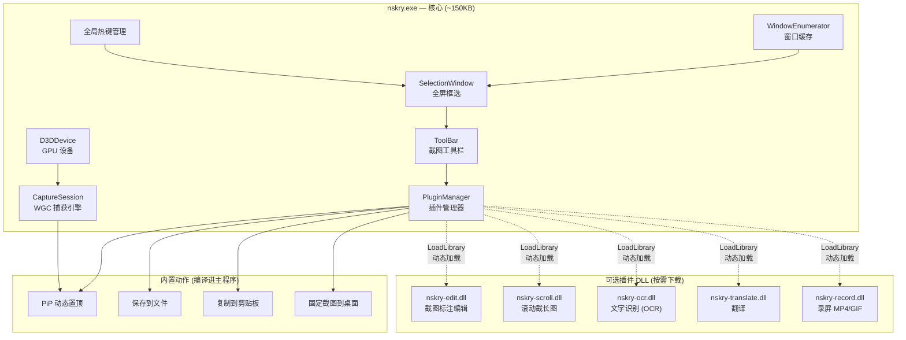

# Nskry — 插件化架构设计与功能路线图

## 1. 设计理念

Nskry 的核心理念是 **"极致轻量的可组装工具箱"**：
- **核心极小**：主程序仅包含截图框选 + PiP 实时监控，体积 < 200KB
- **按需扩展**：截长图、OCR、翻译、录屏等功能各自独立为插件 DLL，用户按需下载
- **开放生态**：提供清晰的 C++ 插件开发 SDK，社区可自行开发插件

---

## 2. 架构总览



---

## 3. 插件接口设计 (Plugin SDK)

每个插件是一个独立的 DLL，导出约定好的 C 函数。核心主程序在启动时扫描 `plugins/` 目录，按需 `LoadLibrary` 加载。

### 3.1 插件 DLL 必须导出的函数

```cpp
// nskry_plugin.h — 这是公开的 SDK 头文件

#pragma once
#include <cstdint>
#include <windows.h>

#ifdef NSKRY_PLUGIN_EXPORTS
#  define NSKRY_API __declspec(dllexport)
#else
#  define NSKRY_API __declspec(dllimport)
#endif

/// 插件能力标志 (位掩码)
enum NskryPluginCaps : uint32_t {
    NSKRY_CAP_TOOLBAR_ACTION  = 1 << 0,   // 在截图工具栏上增加按钮
    NSKRY_CAP_POST_CAPTURE    = 1 << 1,   // 截图完成后的后处理 (如 OCR、翻译)
    NSKRY_CAP_STANDALONE      = 1 << 2,   // 独立全局功能 (如录屏，需要自己的热键)
};

/// 插件描述信息
struct NskryPluginInfo {
    const wchar_t* name;          // "OCR 文字识别"
    const wchar_t* id;            // "nskry-ocr"
    const wchar_t* version;       // "1.0.0"
    const wchar_t* author;        // "Nskry Team"
    const wchar_t* description;   // "识别截图中的文字并复制到剪贴板"
    const wchar_t* iconSvg;       // 工具栏按钮的 SVG 图标 (可选)
    uint32_t       caps;          // NskryPluginCaps 组合
};

/// 宿主提供给插件的上下文 (只读)
struct NskryHostContext {
    HWND                mainHwnd;        // 主消息窗口，用于 PostMessage
    ID3D11Device*       d3dDevice;       // 共享 GPU 设备
    ID3D11DeviceContext* d3dContext;      // 立即上下文
    // 截图结果
    HBITMAP             capturedBitmap;   // 当前截图的 GDI 位图
    RECT                capturedRegion;   // 截图的屏幕坐标
    HWND                sourceHwnd;       // 截图来源窗口
    // 回调
    void (*showNotification)(const wchar_t* msg, int durationMs);
    int32_t (*copyBitmapToClipboard)(HBITMAP hbmp);
};

// ---- 插件必须导出的函数 ----

extern "C" {
    /// 返回插件描述，主程序启动时调用
    NSKRY_API const NskryPluginInfo* nskry_plugin_info();

    /// 插件初始化 (接收宿主上下文)
    NSKRY_API int32_t NSKRY_CALL nskry_plugin_init(const NskryHostContext* ctx);

    /// 执行插件动作 (用户点击工具栏按钮时触发)
    NSKRY_API void nskry_plugin_execute(const NskryHostContext* ctx);

    /// 插件卸载清理
    NSKRY_API void nskry_plugin_shutdown();
}
```

### 3.2 PluginManager 工作流程

```
启动 → 扫描 plugins/*.dll
      → 对每个 DLL: LoadLibrary → GetProcAddress("nskry_plugin_info")
      → 读取 NskryPluginInfo → 注册到工具栏 / 动作列表
      → 用户触发时: nskry_plugin_execute(ctx)
退出 → 逆序 nskry_plugin_shutdown → FreeLibrary
```

---

## 4. 功能分期路线图

### Phase 1：核心重构 — 工具栏 + 插件骨架（已完成）

> **目标**：让截图框选完成后弹出一个工具栏，用户可以选择不同的"动作"

| 子任务 | 说明 |
|--------|------|
| 截图结果缓存 | `SelectionWindow` 完成框选后，将截图区域的 GDI 位图缓存到内存 |
| 工具栏 UI | 截图完成后，在选区下方弹出一条小型工具栏 (复制 / 保存 / 固定 / PiP / ...) |
| PluginManager | 扫描 `plugins/` 目录，加载 DLL，将插件按钮动态注入工具栏 |
| 内置动作分离 | 将 PiP、保存、复制 等动作统一为"内置动作"，与插件共享相同的接口 |

### Phase 2：基础截图功能完善（已完成）

| 功能 | 说明 | 实现形式 |
|------|------|----------|
| **正常截图** | 框选完成后 → 复制到剪贴板 / 保存到文件 | 内置动作 |
| **固定截图** | 框选完成后 → 创建 WS_EX_TOPMOST 窗口显示静态位图，可拖拽、缩放、关闭 | 内置动作 |
| **PiP 监控** | 已完成 ✅ | 内置动作 |

### Phase 3：截图编辑器（已完成）

| 功能 | 说明 | 实现形式 |
|------|------|----------|
| **基础标注** | 矩形、圆、箭头、直线、自由画笔 | `nskry-edit.dll` |
| **文字标注** | 输入文字叠加层 | 同上 |
| **马赛克/高斯模糊** | 对选区进行隐私处理 | 同上 |
| **撤销/重做** | Ctrl+Z / Ctrl+Y | 同上 |
| **应用到固定截图** | 对已固定在桌面的截图进行二次编辑 | 同上 |

### Phase 4：高级功能（截长图已完成；OCR/翻译保留为后续规划）

| 功能 | 说明 | 实现形式 |
|------|------|----------|
| **截长图** | 框选区域 → 手动/自动滚动 → 连续帧位移匹配与拼接 → 预览/裁剪/标注入口 | `nskry-scroll.dll`（已完成） |
| **OCR 文字识别** | Windows.Media.Ocr（内置 API、按需加载、无外置模型） | `nskry-ocr.dll`（首个实现已交付） |
| **翻译** | OCR 结果 → 调用翻译 API → 叠加显示 | `nskry-translate.dll` |

### Phase 5：录屏（未开始）

| 功能 | 说明 | 实现形式 |
|------|------|----------|
| **录制 MP4** | WGC 帧 → Media Foundation H.264 编码 → MP4 | `nskry-record.dll` |
| **录制 GIF** | WGC 帧 → 降采样 → GIF 编码 | 同上 |
| **区域录制** | 与截图框选复用 SelectionWindow | 同上 |

---

## 5. 目录结构规划

```
d:\codes\Nskry\
├── CMakeLists.txt                 # 顶层 CMake
├── sdk/
│   └── nskry_plugin.h             # 公开的插件 SDK 头文件
├── src/
│   ├── pch.h                      # 预编译头
│   ├── main.cpp                   # WinMain + 热键 + 全局编排
│   ├── core/
│   │   ├── plugin_manager.h/cpp   # 插件加载/卸载/调度
│   │   ├── action.h               # 内置动作基类
│   │   └── hotkey_manager.h/cpp   # 热键注册/分发 (从 main.cpp 分离)
│   ├── interop/
│   │   ├── window_info.h          # ✅ 已完成
│   │   ├── window_enumerator.h    # ✅ 已完成
│   │   └── window_enumerator.cpp  # ✅ 已完成
│   ├── capture/
│   │   ├── d3d_device.h/cpp       # ✅ 已完成
│   │   └── capture_session.h/cpp  # ✅ 已完成
│   └── ui/
│       ├── selection_window.h/cpp # ✅ 已完成
│       ├── pip_window.h/cpp       # ✅ 已完成
│       ├── toolbar.h/cpp          # 截图后的动作工具栏
│       └── pin_window.h/cpp       # 固定截图窗口
├── plugins/                       # 可选插件目录
│   ├── nskry-edit/
│   │   ├── CMakeLists.txt
│   │   └── src/...
│   ├── nskry-scroll/
│   ├── nskry-ocr/
│   ├── nskry-translate/
│   └── nskry-record/
├── docs/
│   ├── plugin-dev-guide.md        # 插件开发指南
│   └── architecture.md            # 架构文档
└── build/
    └── Nskry.exe                  # ✅ 已编译通过
```

---

## 6. 技术选型预览

| 功能模块 | 技术方案 | 说明 |
|----------|----------|------|
| 截图编辑 | Direct2D + DirectWrite | GPU 加速 2D 绘制，比 GDI+ 快 10 倍 |
| 截长图 | `SendMessage(WM_VSCROLL)` + WGC 多帧拼接 | 模拟滚动，逐帧捕获后 GPU 拼接 |
| OCR | `Windows.Media.Ocr` (内置) | 零依赖，支持中英日韩，Win10+ 自带 |
| 翻译 | 本地 LLM 或云端 API (可配置) | 插件自行处理网络请求 |
| 录制 MP4 | Media Foundation + H.264 MFT | Windows 内置硬件编码器，零依赖 |
| 录制 GIF | 自研轻量 GIF 编码器 或 集成 gifski | 控制帧率和调色板优化 |

---

## 7. 开发优先级建议

```
Stage A-G / Phase 1-3 已完成
          → Phase 4 截长图（已完成）
          → OCR / 翻译（后续插件规划）
          → Phase 5 录屏（后续插件规划）
```

> [!TIP]
> 发布构建顺序固定为：先用 CMake/Ninja 构建核心与官方插件包，再用 Inno Setup 构建安装器。后续 OCR、翻译和录屏继续以独立插件接入，不改变核心截图与插件 ABI 的职责边界。
